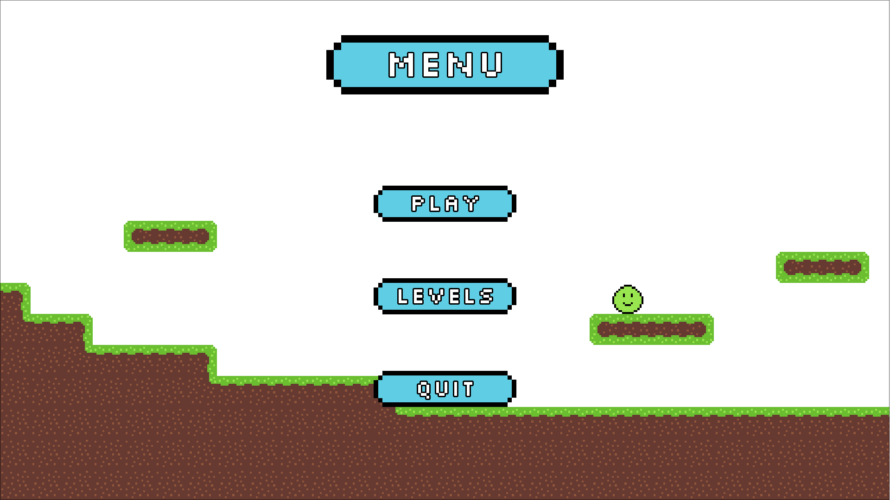

# A simple 2D platformer
Written in Java using the libgdx game development library.



## How to use
```
WASD to walk  
Spacebar to jump  
ESC to pause

Stomp on the slimes! c:
```
## Run
```
./gradlew desktop:run
```